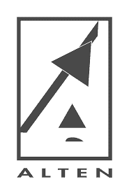

<div id="top"></div>


[![Contributors][contributors-shield]][contributors-url]
[![Forks][forks-shield]][forks-url]
[![Stargazers][stars-shield]][stars-url]
[![Issues][issues-shield]][issues-url]
[![MIT License][license-shield]][license-url]
[![LinkedIn][linkedin-shield]][linkedin-url]


<!-- PROJECT LOGO -->
<br />
<div align="center">
  <a href="https://github.com/rihernandez/alten-booking-service">
    
  </a>

  <h3 align="center">Alten booking service</h3>

  <p align="center">
    An awesome service to integrate with your projects!
    <br />
    <a href="https://github.com/rihernandez/alten-booking-service"><strong>Explore the docs »</strong></a>
    <br />
    <br />
    <a href="#">View Demo</a>
    ·
    <a href="#">Report Bug</a>
    ·
    <a href="#">Request Feature</a>
  </p>
</div>


<!-- TABLE OF CONTENTS -->

<details open>
  <summary>Table of Contents</summary>
  <ol>
    <li>
      <a href="#about-the-project">About The Project</a>
      <ul>
        <li><a href="#built-with">Built With</a></li>
      </ul>
    </li>
    <li>
      <a href="#getting-started">Getting Started</a>
      <ul>
        <li><a href="#prerequisites">Prerequisites</a></li>
        <li><a href="#installation">Installation</a></li>
      </ul>
    </li>
    <li><a href="#usage">Usage</a></li>
    <li><a href="#roadmap">Roadmap</a></li>
    <li><a href="#contributing">Contributing</a></li>
    <li><a href="#license">License</a></li>
    <li><a href="#contact">Contact</a></li>
  </ol>
</details>


<!-- ABOUT THE PROJECT -->
## About The Project

[![Product Name Screen Shot][product-screenshot]](https://example.com)

### Post-Covid scenario:
People are now free to travel everywhere but because of the pandemic, a lot of hotels went
bankrupt. Some former famous travel places are left with only one hotel.
You’ve been given the responsibility to develop a booking API for the very last hotel in Cancun.
The requirements are:
- API will be maintained by the hotel’s IT department.
- As it’s the very last hotel, the quality of service must be 99.99 to 100% => no downtime
- For the purpose of the test, we assume the hotel has only one room available
- To give a chance to everyone to book the room, the stay can’t be longer than 3 days and
can’t be reserved more than 30 days in advance.
- All reservations start at least the next day of booking,
- To simplify the use case, a “DAY’ in the hotel room starts from 00:00 to 23:59:59.
- Every end-user can check the room availability, place a reservation, cancel it or modify it.
- To simplify the API is insecure.
<!-- ----------------------------------------------------------------------------- -->
### Instructions :
- Pas de limite de temps (très bien fait il faut au moins 3 à 4 soirées)
- Le minimum requis est un README et du code.
- Tous les shortcuts pour gagner du temps sont autorisés dans la mesure où c’est
documenté. Tout shortcut non expliqué doit etre consideré comme une erreur. On
pourrait accepter un rendu avec 3 lignes de code si elles ont du sens et que tout le
raisonnement et les problèmatiques à prendre en compte sont decrites. 
-----------------------------------------------------------------------------


<p align="right"><a href="#top">back to top</a></p>


### Built With

For this project I used the minimun stack over Node.js, cause it really shine in building fast, scalable network applications, offering benefits in performance, faster development, and other perks. Here is a short list of all dependencies used.

* [Node.js](https://nextjs.org) _(Open-source, cross-platform, back-end JavaScript runtime environment)._
* [Express.js](https://expressjs.com) _(Back end web application framework for Node.js to build RESTFUL APIs quickly)._ 
* [TypeORM](https://typeorm.io) _(Object-relational mapper for TypeScript and JavaScript that supports many different databases)._
* [Jwt](https://jwt.io) _(Open standard for securely transmitting information between parties as a JSON object)._
* [Swagger/Tsoa](https://tsoa-community.github.io) _(Interface Description Language for describing RESTful APIs expressed using JSON. )._ 
* [Sinon.js](https://sinonjs.org) _(Library that we can use to create object mocks for unit testing)._
* [Chai.js](https://www.chaijs.com) _(BDD / TDD assertion framework for node.js )._
* [Prettier.js](https://www.chaijs.com) _(Code formatter for Javascritp and Typescript)._
* [Husky.js](https://www.chaijs.com) _(Tool to improve the commits)._
* [ESLint.js](https://www.chaijs.com) _(Pluggable and configurable linter tool for identifying and reporting patterns. Keeping code quality)._
* [Docker](https://www.chaijs.com) _(Open platform for developing, shipping, and running applications.)._


<p align="right"><a href="#top">back to top</a></p>


<!-- GETTING STARTED -->
## Getting Started

This is a step by step guide on how you can set up the project locally.
To get a local copy up and running, follow these simple steps.

### Prerequisites

 This project use `Nodejs 12.22.0` for correct performance.</br>
 So make sure you have `nvm` as node version manager installed on your system.</br>
To install nvm, follow this [link](https://gist.github.com/d2s/372b5943bce17b964a79) and then continue configuring as below:


  * Installing
  ```sh
  nvm install v12.22.0
  ```
  * Setting up 
  ```sh
  nvm alias default v12.22.0
  
  nvm use v12.22.0
  ```

### Installation

There are two ways to install the app, please choose the best one you consider.

#### `1 - Local instalation`

* _This application dynamically generates an .env file with the data contained in a slightly modified base64 token. Therefore, before installing any package or even starting to run the application, a short check will always be performed on the ENV_TOKEN variable._</br>

1. Get modified base64 token at [https://example.com](https://example.com)
2. Set your token in a `terminal`
   ```bash
   export ENV_TOKEN = 'ENTER YOUR TOKEN';
   ```
3. Clone the repo
   ```sh
   git clone https://github.com/rihernandez/alten-booking-service.git
   ```
4. Install NPM packages
   ```sh
   npm install
   ```

#### `2 - Docker instalation`

1. Clone the repo
   ```sh
   git clone https://github.com/rihernandez/alten-booking-service.git
   ```
2. Navigate to the root directory thought terminal and execute:
   ```sh
   docker-compose up -d
   ```
4. If you chose to install via docker no further action is required and you can finish this installation guide. 
5. Clic [here](http://localhost:3000/api/v1/docs) to open API documentation in the browser.
  

<p align="right"><a href="#top">back to top</a></p>


<!-- USAGE EXAMPLES -->
## Usage

Use this space to show useful examples of how a project can be used. Additional screenshots, code examples and demos work well in this space. You may also link to more resources.

  * Build the application
  ```sh
  npm run build
  ```
  * Run the application
  ```sh
  npm start
  ```

  * Clic [here](http://localhost:3000/api/v1/docs) to open the browser and see the [API Documentation](http://localhost:3000/api/v1/docs).
  


<p align="right"><a href="#top">back to top</a></p>


<!-- ROADMAP -->
## Roadmap

- [x] Add models to create entities
- [x] Add controllers and routes
- [x] Adding API documentation
- [ ] Apply JWt token for API security
- [ ] Multi-language Support
    - [ ] English
    - [ ] Spanish

See the [open issues](https://github.com/rihernandez/alten-booking-service/issues) for a full list of proposed features (and known issues).

<p align="right"><a href="#top">back to top</a></p>


<!-- CONTRIBUTING -->
## Contributing

Contributions are what make the open source community such an amazing place to learn, inspire, and create. Any contributions you make are **greatly appreciated**.

If you have a suggestion that would make this better, please fork the repo and create a pull request. You can also simply open an issue with the tag "enhancement".
Don't forget to give the project a star! Thanks again!

1. Fork the Project
2. Create your Feature Branch (`git checkout -b feature/AmazingFeature`)
3. Commit your Changes (`git commit -m 'feature: Adding some AmazingFeature'`)
4. Push to the Branch (`git push origin feature/AmazingFeature`)
5. Open a Pull Request

<p align="right"><a href="#top">back to top</a></p>


<!-- LICENSE -->
## License

Distributed under the MIT License. See `LICENSE.txt` for further information.

<p align="right"><a href="#top">back to top</a></p>


<!-- CONTACT -->
## Contact

Richard HC - [WhatsApp](https://wa.me/18299047782) 


<p align="right"><a href="#top">back to top</a></p>


<!-- #reference-style-links -->
[contributors-shield]: https://img.shields.io/github/contributors/rihernandez/alten-booking-service.svg?style=for-the-badge
[contributors-url]: https://github.com/rihernandez/alten-booking-service/graphs/contributors
[forks-shield]: https://img.shields.io/github/forks/rihernandez/alten-booking-service.svg?style=for-the-badge
[forks-url]: https://github.com/rihernandez/alten-booking-service/network/members
[stars-shield]: https://img.shields.io/github/stars/rihernandez/alten-booking-service.svg?style=for-the-badge
[stars-url]: https://github.com/rihernandez/alten-booking-service/stargazers
[issues-shield]: https://img.shields.io/github/issues/rihernandez/alten-booking-service.svg?style=for-the-badge
[issues-url]: https://github.com/rihernandez/alten-booking-service/issues
[license-shield]: https://img.shields.io/github/license/rihernandez/alten-booking-service.svg?style=for-the-badge
[license-url]: https://github.com/rihernandez/alten-booking-service/blob/master/LICENSE.txt
[linkedin-shield]: https://img.shields.io/badge/-LinkedIn-black.svg?style=for-the-badge&logo=linkedin&colorB=555
[linkedin-url]: https://do.linkedin.com/in/richardhc
[product-screenshot]: images/screenshot.png